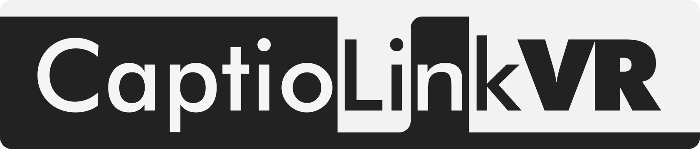

  

 

VR空間に字幕を表示するツールです。 
本ツールが対応しているVRChatワールドで、HMD上に字幕を表示しながら楽しめます。 

https://github.com/user-attachments/assets/29b3b1a1-9c6f-4951-88a3-06d8700521ec

※撮影のため、ツール画面はXSOverlayを使用しています。 
 

## 💻 動作環境
- Windows
- SteamVR

 

## 🚀 使い方（概要）
1. **プリセット**から見たい字幕を選び、対応するVRChatワールドへ移動する。
2. **字幕カウントダウン開始**を押して、字幕のカウントダウンが0になる瞬間に合わせてワールド内の演出再生ギミックを手動起動する。
3. 楽しむ。

詳しい再生タイミングなどは、各プリセットの説明文を参照してください。

## 🚀 使い方（詳細）
#### 1. 準備
- **ツールの起動:** ダウンロードしたファイル`CaptioLinkVR.zip`を解凍し、セキュリティ警告を許可（通過）のうえ、`.exe` ファイルを起動します。
    
    > **Note:** 個人開発ツールあるあるですが、未署名ファイルのためWindowsに「怪しいソフトかも？」と一時的にブロックされることがあります（※実績がないソフトに対するWindowsの標準仕様です）。 ご利用の際は、**「詳細情報」→「実行」**を押して進めてください！

#### 2. 事前確認
- **接続確認:** SteamVRが接続され、ツール側に認識されているか確認します。（VRChat を PCVR で起動していれば、SteamVR は自動で起動していることが多いです）
- **表示テスト:** 「字幕テスト送信」を行い、HMD上に字幕が表示されるか確認します。
    > **Note:** 文字が見えにくい場合は、この段階でサイズや位置を調整してください。
- **プリセット選択:** テスト送信を停止し、使用するプリセットを選択します。
    
#### 3. 本番手順
1. **開始タイマーの起動**
    ワールド内の演出開始ギミックに触れないよう注意しながら、ツールの「カウントダウンを開始する」をクリックします。
    
2. **カウントダウンの確認**
    HMD上に字幕でカウントダウンが表示されます。
    ※表示に問題がなければ、「字幕カウントダウン開始」以降はツール画面の操作は不要です。
    
3. **演出のスタート**
    カウントダウンが「00:00 スタート」になったと同時に、ワールド内の演出ギミックを発動させます。
    
    これで字幕とワールド演出のタイミングが同期します。お楽しみください。

 

## ⚠️ 注意
本ツールは、基本的に**一人用**です。
**字幕を再生する本人が、ワールド側のギミックも起動する**使い方を想定しています。

字幕の表示・再生開始はご自身の PC 上でのみ行われ、周囲のプレイヤーには共有されません。ワールド側の演出開始も各プレイヤーのローカル再生に依存するため、通信遅延などにより他の人とタイミングがずれることがあります。同じインスタンスで複数人が同時に字幕を使う用途には向いていません。

 
 

#### 📬 連絡先 - Shiina Sakamoto です。今のところ僕が色々やっています。
- X（DMはたまに閉じています）: `@Shiina_12siy`
- Discord: `shiina_12siy`

（Discord が今のところ助かります。）

 
 

## 📄 ライセンス
本リポジトリは複合ライセンスです。
- **ソースコード**: [MIT License](LICENSE)（Copyright (c) 2026 Shiina Sakamoto）
- **ロゴ・ブランド画像**: All Rights Reserved（Copyright (c) 2026 Shiina Sakamoto）
- **同梱字幕プリセット (`captions/`)**: 各原著作権者に帰属。無断転載・改変・翻案・商用利用は不可。[`captions/LICENSE.md`](captions/LICENSE.md) を参照（**日本語を正文**、英語は参考訳）
- **第三者コンポーネント**: [`THIRD_PARTY_NOTICES.md`](THIRD_PARTY_NOTICES.md) および [`licenses/`](licenses/)

ソースコード（MIT）の利用条件は [LICENSE](LICENSE) に従います。一方、`captions/` およびロゴ・ブランド資産は MIT の対象外であり、リポジトリのクローンや閲覧をもって再配布・ミラー・別配布の権利が付与されるものではありません。

 

## 免責
CaptioLinkVR は Valve Corporation / SteamVR、および VRChat Inc. とは無関係の個人制作の非公式ツールです。各社の公式製品・公式サポートではありません。
